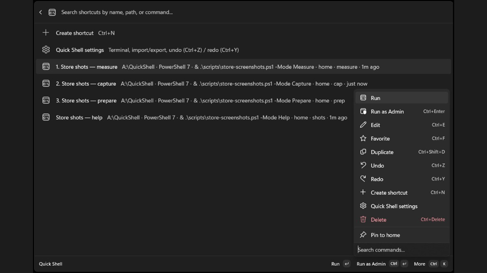
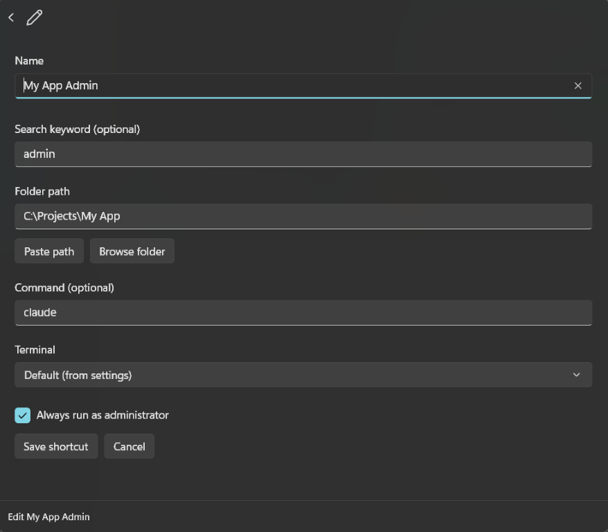
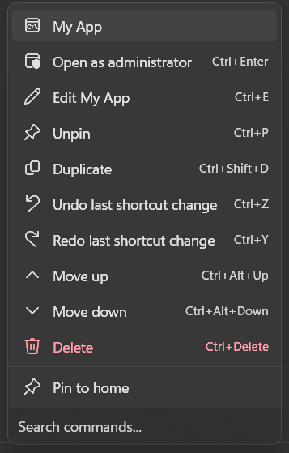

# Quick Shell

**Open your favorite project folders from [PowerToys Command Palette](https://learn.microsoft.com/windows/powertoys/command-palette/overview) — in one search.**

Save directories you use every day, open them in whichever terminal you actually use, optionally run a command on open (`dotnet run`, `npm run dev`, and so on), and jump there without digging through File Explorer.

---

## What you can do

- **Save shortcuts** to folders you open often, with optional **home keywords** for fast root search
- **Any terminal you use** — Windows Terminal, Intelligent Terminal, every profile on your PC, plus WSL and classic shells
- **Run a command on open** — start dev servers, scripts, or anything else automatically
- **Favorite shortcuts** so they stay at the top of your list
- **Create and edit shortcuts in Command Palette** — no hand-editing JSON required
- **Undo and redo** shortcut edits from the list, settings row, or **Ctrl+Z** / **Ctrl+Y**
- **Section headers** in your shortcut list to group projects
- **Import and export shortcuts** as JSON from **Quick Shell settings** (backup, sharing, migration)
- **Open elevated** when you need admin — from the ⋯ menu or with **Ctrl+Enter**
- **Search from the root palette** — type a home keyword like `api` and matching shortcuts appear without opening the extension first

---

## Terminals

Quick Shell reads **Windows Terminal** and **Intelligent Terminal** `settings.json` files and lists **every profile** you have configured — including custom shells such as Alacritty, WezTerm, Git Bash, or Ubuntu. It also discovers **WSL** distros and classic shells on your PATH (**PowerShell**, **pwsh**, **cmd**).

**Quick Shell settings** splits terminal choice the same way Windows does:

| Setting | What it controls |
| --- | --- |
| **Terminal application** | Host executable (`wt.exe` or `wtai.exe`) for Default shortcuts and profile launches |
| **Default profile** | Profile used when a shortcut’s terminal is set to **Default** |

Per-shortcut **profile** choices stay on each shortcut in the editor. Host options include **Let Windows choose** and **Windows Console Host** for classic `cmd` / PowerShell launches.

Default **terminal application** and **default profile** are saved to `%LOCALAPPDATA%\QuickShell\settings.json` and survive reloads.

After you install a new terminal or edit profiles, use **Refresh terminal list** in **Quick Shell settings** or the **↻** button next to the terminal picker when creating or editing a shortcut.

---

## Requirements

- Windows 10 version 2004 (build 19041) or later — **Windows 11 recommended**
- [PowerToys](https://learn.microsoft.com/windows/powertoys/install) with **Command Palette** enabled

---

## Install

### Option 1 — WinGet (easiest)

```powershell
winget install tonythethompson.QuickShell
```

### Option 2 — Download an installer

Get the latest **x64** or **ARM64** installer from [GitHub Releases](https://github.com/tonythethompson/QuickShell/releases).

### After installing

1. Open **PowerToys Command Palette** (default: **Win + Alt + Space**)
2. Run **`Reload Command Palette Extension`**
3. Search **`Quick Shell`**

You should see **Quick Shell** with the subtitle *Open saved folders in any terminal you use*.

---

## Quick start

Open Command Palette, search **Quick Shell**, and you’re in.

### 1. Browse shortcuts — **Ctrl+K** for everything else

Search, favorite, edit, duplicate, undo, and run — all from the list and its context menu.



### 2. Edit in place — folder, command, terminal, admin

No JSON required. Pick a folder, optional command, profile, and whether to launch elevated.



### 3. Settings — defaults, backup, import

Set your default terminal host and profile, export a backup, or import shortcuts from another PC. **Merge** keeps yours and adds new names; **Replace all** swaps the whole file.



**Create shortcut** is at the top of the list (**Ctrl+N**). **Quick Shell settings** is the row below it — or use **⋯** → **Quick Shell settings** on any shortcut.

Your shortcuts live at `%LOCALAPPDATA%\QuickShell\shortcuts.json`. The app creates this on first run; you can also manage everything from Command Palette.

> **Tip:** If the extension does not appear, confirm Command Palette is on in PowerToys → Command Palette, then run **Reload Command Palette Extension** again.

---

## Everyday usage

Open the **⋯** menu on any shortcut (or press **Ctrl+K**) for edit, favorite, duplicate, undo, and elevated launch.

| What you want | How |
| --- | --- |
| Open a saved folder | Search **Quick Shell**, pick a shortcut, **Enter** |
| Jump straight to a shortcut | Type its **home keyword** at the Command Palette home screen (e.g. `api`) |
| Create a shortcut | **Create shortcut** at the top of the list (**Ctrl+N**), or **⋯** → **Create shortcut** |
| Favorite a shortcut | **⋯** → **Favorite**, or **Ctrl+F** |
| Reorder favorites | **⋯** → **Move favorite up** / **down** / **to top** / **to bottom** |
| Edit a shortcut | **⋯** → **Edit**, or **Ctrl+E** |
| Undo / redo | Select a row → **Ctrl+Z** / **Ctrl+Y**, or **⋯** → **Undo** / **Redo** |
| Open once as admin | **⋯** → **Run as Admin**, or **Ctrl+Enter** |
| Always open as admin | Enable **Launch elevated** in the editor, or `"RunAsAdmin": true` in JSON |
| Change default terminal or profile | Open **Quick Shell settings** (list row or **⋯** on any shortcut) |
| Refresh terminal list | **Quick Shell settings** → **Refresh terminal list**, or **↻** in the editor |
| Back up or move shortcuts | **Quick Shell settings** → **Export** / **Import** |
| Resolve import conflicts | **Merge** (keep yours, add new, rename duplicates) or **Replace all** (file only) |
| Reload after hand-editing JSON | Changes load automatically when Quick Shell reads the file |

---

## Shortcut options

Each shortcut supports these fields in `shortcuts.json`:

| Field | Required | Description |
| --- | --- | --- |
| `Name` | Yes | Display name in Command Palette |
| `Directory` | Yes | Folder to open |
| `Abbreviation` | No | **Home keyword** — type at the Command Palette home screen to jump to this shortcut (e.g. `api`). JSON field name stays `Abbreviation`. |
| `Command` | No | Command to run after opening the folder |
| `Terminal` | No | Launch target: `default`, `wt` (profile — pair with `WtProfile`), `it`, `powershell`, `pwsh`, `cmd`, or `wsl`. The global **terminal application** setting chooses `wt.exe` vs `wtai.exe` for profile launches. |
| `RunAsAdmin` | No | `true` to always launch elevated (UAC prompt); also available as a checkbox when editing in Command Palette |
| `IsPinned` | No | `true` to favorite the shortcut (keeps it at the top of your Quick Shell list) |

Mix **section headers** into the same array with shortcut objects:

| Field | Required | Description |
| --- | --- | --- |
| `Type` | Yes (for headers) | Set to `"separator"` for a titled section header |
| `Title` | No | Section label shown in the list (omit for a blank divider) |

Favorited shortcuts (`IsPinned`) always appear under a **Favorites** header at the top and are not repeated under layout sections.

Example:

```json
[
  {
    "Name": "My API",
    "Abbreviation": "api",
    "Directory": "C:\\Projects\\MyApi",
    "Command": "dotnet run",
    "Terminal": "wt"
  },
  {
    "Type": "separator",
    "Title": "Web"
  },
  {
    "Name": "Frontend",
    "Directory": "C:\\Projects\\web",
    "Command": "npm run dev",
    "Terminal": "wt"
  }
]
```

More examples: [`shortcuts.example.json`](shortcuts.example.json).

---

## Troubleshooting

**Extension missing after install**  
Run **Reload Command Palette Extension** in Command Palette. Restart PowerToys if needed.

**Shortcuts disappeared after an update**  
Check `%LOCALAPPDATA%\QuickShell\shortcuts.json.bak` for a backup. Older installs may also have left a copy at `%LOCALAPPDATA%\TerminalShortcutsCmdPal\shortcuts.json`.

**Duplicate or broken Quick Shell in Windows Settings**  
You may have an old installer alongside a newer one. In **Settings → Apps**, uninstall extra **Quick Shell** entries and keep a single install.

**WinGet install works but Command Palette integration is incomplete**  
The WinGet installer registers the extension for discovery. For local development or the fullest MSIX integration, see [Building from source](#building-from-source) below.

---

## Building from source

For contributors and local MSIX installs (recommended for development):

**Prerequisites:** Windows 11, .NET 10 SDK, Visual Studio 2022 (Windows workload), PowerToys with Command Palette enabled.

```powershell
# MSIX install (dev-signed, full Command Palette integration)
.\scripts\deploy.ps1

# WinGet-style EXE installers (x64 + ARM64)
cd QuickShell
.\build-exe.ps1 -Version 0.1.6.0
```

Then run **Reload Command Palette Extension** in Command Palette.

---

## License

MIT — see [LICENSE](LICENSE).

## Feedback

[Open an issue](https://github.com/tonythethompson/QuickShell/issues) on GitHub for bugs, ideas, or questions.
