# Quick Shell

**Open your favorite project folders from [PowerToys Command Palette](https://learn.microsoft.com/windows/powertoys/command-palette/overview), [PowerToys Run](https://learn.microsoft.com/en-us/windows/powertoys/run), or [Raycast for Windows](https://www.raycast.com/windows) in one search.**

Save directories you use every day, open them in whichever terminal you actually use, optionally run a command on open (`dotnet run`, `npm run dev`, and so on), and jump there without digging through File Explorer.

---

## What you can do

- **Save workspaces** to folders you open often, with optional **home keywords** for fast root search
- **Any terminal you use:** Windows Terminal, Intelligent Terminal, every profile on your PC, plus WSL and classic shells
- **Multiple launches per workspace:** run several terminals or commands from one folder (API + frontend, shell + dev server, and so on)
- **Tabbed multi-launch:** when several launches share the same Windows Terminal host, they open as **tabs in one window** instead of separate windows
- **Run commands on open:** start dev servers, scripts, or anything else automatically
- **Suggested commands:** click a pill to add a project-aware launch command based on what's in the folder (`package.json`, `*.csproj`, `docker-compose.yml`, and more)
- **Repo-aware workspace setup:** creating or discovering a workspace can pre-fill multiple launch rows from the project layout
- **Task search:** search by launch label or command (e.g. `dev`, `frontend`, `dotnet watch`) from the Command Palette home screen or inside Quick Shell
- **Git branch targets:** pin a branch per worktree folder; Quick Shell switches before launch and remembers targets across linked worktrees
- **Workspace health checks:** pre-launch validation, runtime signals (ports in use, matching processes), and status badges on the list
- **Discover git repos:** scan local folders and add repositories as workspaces
- **Favorite workspaces** so they stay at the top of your list, with **Recent** and **Workspaces** sections below
- **Create and edit in Command Palette:** no hand-editing JSON required
- **Undo and redo** edits from the list, settings row, or **Ctrl+Z** / **Ctrl+Y**
- **Section headers** in your list to group projects
- **Import and export workspaces** as JSON from **Quick Shell settings** (backup, sharing, migration)
- **Open elevated** when you need admin, from the ⋯ menu or with **Ctrl+Enter**
- **Optional dev server, repo, and companion app links:** open a browser tab or editor when a workspace runs
- **Search from the root palette:** type a home keyword like `api` and matching workspaces appear without opening the extension first
- **PowerToys Run** on WinGet and GitHub installs: type **`qs`** in Run (**Alt+Space**) to open the same workspaces from a second launcher

---

## Quick start

Open Command Palette, search **Quick Shell**, and you're in.

### 1. Browse workspaces (**Ctrl+K** for everything else)

Search, favorite, edit, duplicate, undo, and run, all from the list and its context menu.

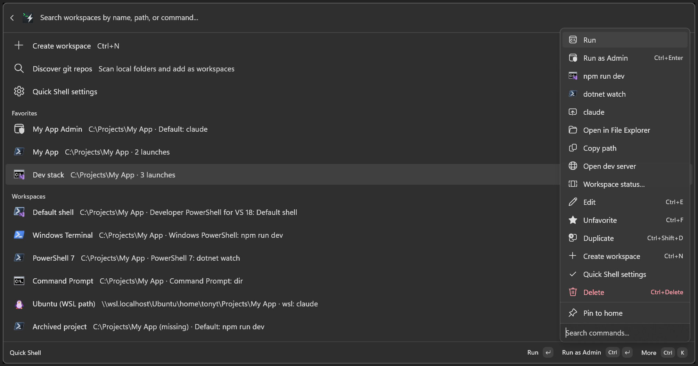

### 2. Edit in place (folder, command, terminal, admin)

No JSON required. Pick a folder, optional command, profile, and whether to launch elevated.

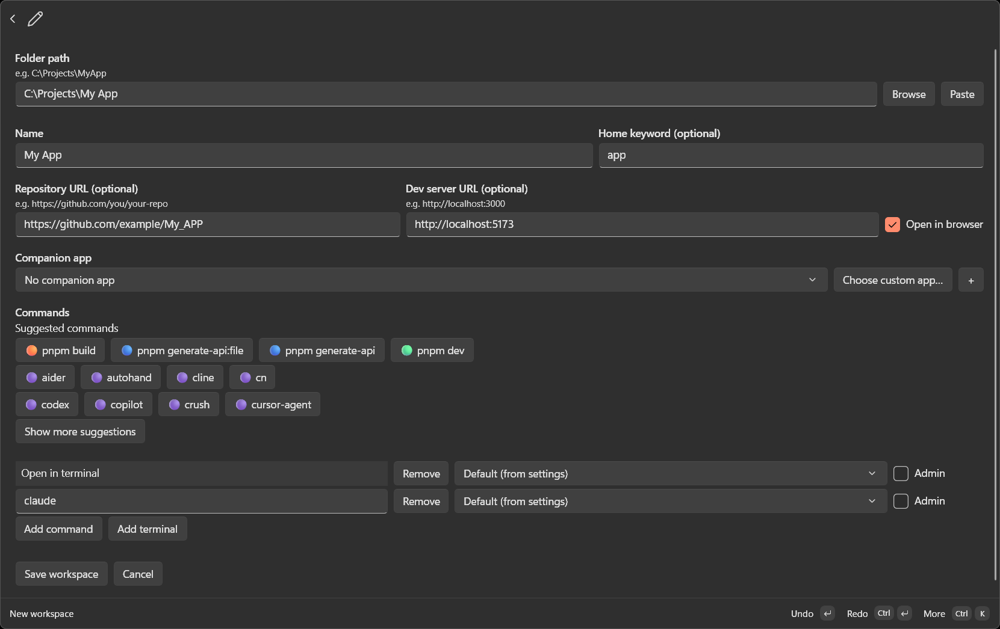

### 3. Settings (defaults, backup, import, git launch)

Set your default terminal host and profile, configure **git launch** safety (block when dirty + branch switch), export a backup, or import workspaces from another PC. **Merge** keeps yours and adds new names; **Replace all** swaps the whole file.

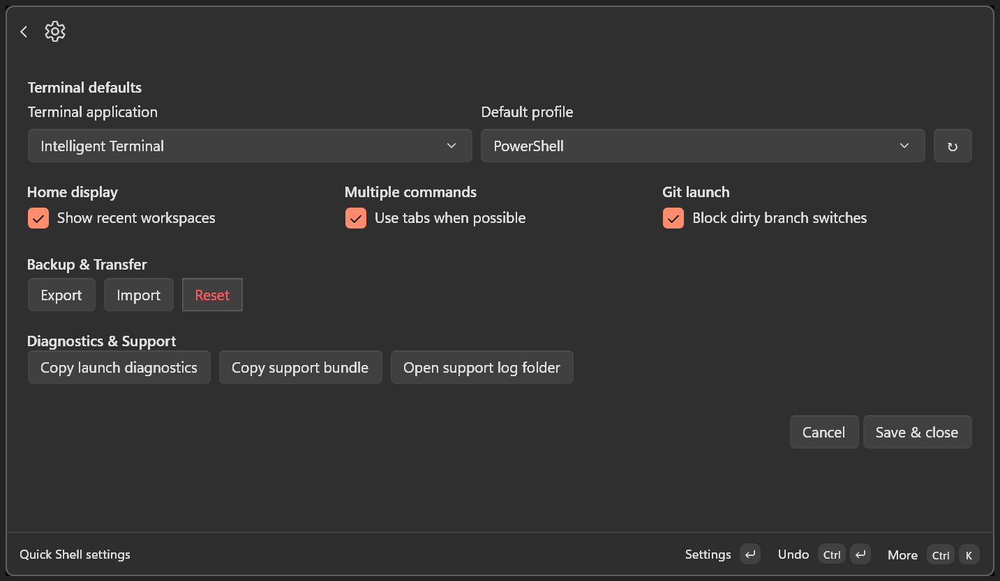

At the top of the list: **Create workspace** (**Ctrl+N**), then **Discover git repos**, then **Quick Shell settings**. You can also open settings from **⋯** → **Quick Shell settings** on any workspace.

### 4. Discover git repos

Scans common project folders and lists repositories not yet saved as workspaces — add one with a click, or pin it straight to home.

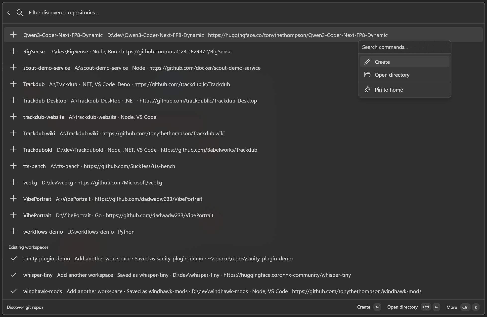

Your workspaces are stored in `%LOCALAPPDATA%\QuickShell\shortcuts.json`. Git branch targets live in `%LOCALAPPDATA%\QuickShell\worktree-branch-targets.json`. The app creates these on first run; you can also manage everything from Command Palette.

> **Tip:** If the extension does not appear, confirm Command Palette is on in PowerToys → Command Palette, then run **Reload Command Palette Extension** again.

---

## Everyday usage

Open the **⋯** menu on any workspace (or press **Ctrl+K**) for edit, favorite, duplicate, undo, and elevated launch.

| What you want | How |
| --- | --- |
| Open a saved folder | Search **Quick Shell**, pick a workspace, **Enter** |
| Open from PowerToys Run | **Alt+Space** → `qs`, pick a workspace (WinGet / GitHub install) |
| Run one launch from a multi-launch workspace | **⋯** → pick the launch by label (e.g. **Frontend**, **API**) |
| Jump straight to a workspace | Type its **home keyword** at the Command Palette home screen (e.g. `api`) |
| Run a specific task from anywhere | At the Command Palette home screen, search by launch label or command (e.g. `dev`, `dotnet watch`) |
| Create a workspace | **Create workspace** at the top of the list (**Ctrl+N**), or **⋯** → **Create workspace** |
| Discover local git repos | **Discover git repos** on the home list |
| Check workspace health | **⋯** → **Workspace status…** |
| Set or switch git branch target | Edit workspace details → **Target branch**, or **Workspace status…** → **Switch branch…** |
| Allow launch on a dirty tree | **Quick Shell settings** → **Git launch** → turn off **Block launch when dirty and branch would change** |
| Add a suggested command row | In the workspace editor, use **Suggested commands** when shown |
| Favorite a workspace | **⋯** → **Favorite**, or **Ctrl+F** |
| Duplicate a workspace | **⋯** → **Duplicate**, or **Ctrl+Shift+D** |
| Delete a workspace | **⋯** → **Delete**, or **Ctrl+Delete** |
| Reorder favorites | **⋯** → **Move favorite up** / **down** / **to top** / **to bottom**, or **Ctrl+Alt+Up** / **Down** |
| Edit a workspace | **⋯** → **Edit**, or **Ctrl+E** |
| Undo / redo | Select a row → **Ctrl+Z** / **Ctrl+Y**, or **⋯** → **Undo** / **Redo** |
| Open once as admin | **⋯** → **Run as Admin**, or **Ctrl+Enter** |
| Always open as admin | Enable **Launch elevated** in the editor, or `"RunAsAdmin": true` in JSON |
| Change default terminal or profile | Open **Quick Shell settings** (list row or **⋯** on any workspace) |
| Set how many recents to show | **Quick Shell settings** → **Recent workspaces to show** |
| Refresh terminal list | **Quick Shell settings** → **Refresh terminal list**, or **↻** in the editor |
| Copy last launch diagnostics | **⋯** → **Copy launch diagnostics**, or **Quick Shell settings** after a failed launch |
| Copy a redacted support bundle | **Workspace status…** or **Quick Shell settings** → **Copy support bundle** |
| Open redacted support logs | **Workspace status…** or **Quick Shell settings** → **Open support log folder** |
| Back up or move workspaces | **Quick Shell settings** → **Export workspaces** / **Import workspaces** |
| Reset all workspaces | **Quick Shell settings** → **Reset all workspaces** (backup `.bak` is kept) |
| Resolve import conflicts | **Merge** (keep yours, add new, rename duplicates) or **Replace all** (file only) |
| Reload after hand-editing JSON | Changes load automatically when Quick Shell reads the file |

---

## Workspace options (`shortcuts.json`)

Each workspace is stored in `%LOCALAPPDATA%\QuickShell\shortcuts.json`. The filename is historical; entries are workspaces in the UI.

### Core fields

| Field | Required | Description |
| --- | --- | --- |
| `Name` | Yes | Display name in Command Palette |
| `Directory` | Yes | Folder to open |
| `Abbreviation` | No | **Home keyword:** type at the Command Palette home screen to jump to this workspace (e.g. `api`). JSON field name stays `Abbreviation`. |
| `IsPinned` | No | `true` to favorite the workspace (keeps it at the top under **Favorites**) |
| `RunAsAdmin` | No | `true` to always launch elevated (UAC prompt); also available as a checkbox when editing |

**Target branch** is not stored in `shortcuts.json`. Set it in the workspace editor or **Workspace status…**; Quick Shell persists it in `%LOCALAPPDATA%\QuickShell\worktree-branch-targets.json` keyed by git worktree.

### Legacy single-launch fields

Still supported; synthesized into `Launches` on load when `Launches` is empty:

| Field | Required | Description |
| --- | --- | --- |
| `Command` | No | Command to run after opening the folder |
| `Terminal` | No | Launch target: `default`, `wt` (pair with `WtProfile`), `it`, `powershell`, `pwsh`, `cmd`, or `wsl`. The global **terminal application** setting chooses `wt.exe` vs `wtai.exe` for profile launches. |
| `WtProfile` | No | Windows Terminal or Intelligent Terminal profile name when `Terminal` is `wt` or `it` |

### Multi-launch (`Launches`)

Preferred for multiple terminals or commands per workspace. Each entry:

| Field | Required | Description |
| --- | --- | --- |
| `Label` | No | Display name for this launch in the editor and context menu |
| `Terminal` | No | Same values as the legacy `Terminal` field |
| `WtProfile` | No | Profile name when using `wt` or `it` |
| `Command` | No | Command to run for this launch |
| `RunAsAdmin` | No | `true` to launch this entry elevated |
| `IsEnabled` | No | `false` to skip this launch (default `true`) |
| `Order` | No | Sort order when multiple launches are enabled |
| `TaskType` | No | Task category metadata for search and suggestions: `none`, `api`, `frontend`, `services`, `logs`, `test`, or `build` |

### Optional links and companion app

| Field | Required | Description |
| --- | --- | --- |
| `DevServerUrl` | No | `http://` or `https://` URL opened in your browser when the workspace runs (if **Open on launch** is enabled) |
| `OpenDevServerOnLaunch` | No | `true` to open `DevServerUrl` whenever the full workspace runs |
| `RepoUrl` | No | Repository URL opened from the workspace context menu |
| `CompanionApps` | No | Ordered list of companion apps (`Path`, `Arguments`, `OpenOnLaunch`, `Order`); max 5 |
| `CompanionAppPath` | No | Primary companion path (mirrored from first `CompanionApps` entry; still dual-read) |
| `CompanionAppArguments` | No | Primary arguments; use `.` or `{folder}` for the workspace directory |
| `OpenCompanionAppOnLaunch` | No | Primary open-on-launch flag (mirrored); per-entry flags on `CompanionApps` win for multi |

Mix **section headers** into the same array with workspace objects:

| Field | Required | Description |
| --- | --- | --- |
| `Type` | Yes (for headers) | Set to `"separator"` for a titled section header |
| `Title` | No | Section label shown in the list (omit for a blank divider) |

Favorited workspaces (`IsPinned`) appear under **Favorites** at the top, then **Recent**, then the rest under **Workspaces** (favorites and recents are not repeated in the workspace list). Configure how many recents appear in **Quick Shell settings**.

Example (legacy single-launch shape, still valid):

```json
[
  {
    "Name": "My API",
    "Abbreviation": "api",
    "Directory": "C:\\Projects\\MyApi",
    "Command": "dotnet run",
    "Terminal": "wt"
  },
  {
    "Type": "separator",
    "Title": "Web"
  },
  {
    "Name": "Frontend",
    "Directory": "C:\\Projects\\web",
    "Command": "npm run dev",
    "Terminal": "wt"
  }
]
```

More examples: [`shortcuts.example.json`](shortcuts.example.json).

---


## Workspace health

Before a workspace launches, Quick Shell runs a **health check** and surfaces problems early.

| Signal | What it means |
| --- | --- |
| **Blocking errors** | Missing folder, invalid launch, unknown terminal profile, missing executable, or WSL distro. Launch is blocked with a clear message. |
| **Warnings** | Dev-server port already in use, or a matching process already running |
| **Git state** | Current branch and whether the working tree is clean or dirty |
| **Branch mismatch** | Configured target branch differs from the checked-out branch |
| **Running** | Port or process heuristics suggest the workspace may already be up |

In the workspace list, badges call out items that need attention (warning icon) or appear to be running (activity icon). Open **⋯** → **Workspace status…** for a full snapshot (launches, git, runtime signals, and attention items), with **Refresh**, detailed **Copy launch diagnostics**, and redacted support-bundle/log-folder actions.

---

## Git branches and worktrees

Quick Shell understands **git worktrees**: each linked worktree folder gets its own **target branch**, stored in `%LOCALAPPDATA%\QuickShell\worktree-branch-targets.json` (separate from `shortcuts.json`).

- Set a **target branch** in workspace details, or use **⋯** → **Workspace status…** → **Switch branch…**
- On launch, Quick Shell checks out the target branch when it differs from HEAD
- **Use current branch** clears the target so launches follow whatever is checked out
- **Git launch** settings control whether launch is blocked when the tree is **dirty** and a branch switch would be required (on by default)

Need two branches open at once? Use `git worktree add` for a second folder, then save it as its own workspace with its own target.

---

## Quick add commands

When editing a workspace, **Suggested commands** appear as clickable pills for folders Quick Shell recognizes (Command Palette and PowerToys Run) or as a picker in the Raycast extension. Each pill shows a concrete command such as `API · dotnet watch` — click once to fill the first empty launch row (or append a new row). Suggestions are based on files in the folder only; nothing is sent over the network.

| Behavior | Detail |
| --- | --- |
| **Label** | `{Type} · {command}` (for example `Frontend · npm run dev`) |
| **On click** | Inserts the command string; stores task type metadata on the row |
| **After add** | That pill hides while the command is in use |
| **Clear row** | Use the **×** on the command field (CmdPal/Run) or clear the text; the pill returns |
| **Undo** | **Ctrl+Z** / **Ctrl+Y** in CmdPal and Run undo pill add, clear, and show-more toggles (not per-keystroke command typing) |
| **Save** | Blank rows are dropped; at least one launch row is kept |
| **Editor padding** | New/edit forms start with three empty launch rows so the first few pill clicks avoid layout rebuilds (CmdPal) |

Suggestions come from `package.json` scripts, .NET projects, `docker-compose.yml`, Make/Just/Taskfile targets, VS Code tasks, and other markers in the folder. **Browse/Paste on create or edit does not auto-fill commands or companion apps** (use suggestion pills / pick a companion). **Discover git repos** still heuristically seeds launches and a companion when the project layout is clear.

**Privacy:** classification reads only the workspace folder you chose. Commands may appear in tooltips; they are not uploaded. Local support logs are redacted JSONL under `%LOCALAPPDATA%\QuickShell\logs` and omit workspace names, paths, commands, exception messages, and arbitrary data. Raycast uses the local `QuickShell.Suggest` helper (`QUICKSHELL_SUGGEST_EXE` overrides its path for development).

---

## Terminals

Quick Shell reads **Windows Terminal** and **Intelligent Terminal** `settings.json` files and lists **every profile** you have configured, including custom shells such as Alacritty, WezTerm, Git Bash, or Ubuntu. It also discovers **WSL** distros and classic shells on your PATH (**PowerShell**, **pwsh**, **cmd**).

**Quick Shell settings** splits terminal choice the same way Windows does:

| Setting | What it controls |
| --- | --- |
| **Terminal application** | Host executable (`wt.exe` or `wtai.exe`) for Default launches and profile launches |
| **Default profile** | Profile used when a workspace's terminal is set to **Default** |

Per-workspace **profile** choices stay on each workspace in the editor. Host options include **Let Windows choose** and **Windows Console Host** for classic `cmd` / PowerShell launches.

Default **terminal application** and **default profile** are saved to `%LOCALAPPDATA%\QuickShell\settings.json` and survive reloads.

After you install a new terminal or edit profiles, use **Refresh terminal list** in **Quick Shell settings** or the **↻** button next to the terminal picker when creating or editing a workspace.

---

## Requirements

- Windows 10 version 2004 (build 19041) or later. **Windows 11 recommended.**
- [PowerToys](https://learn.microsoft.com/windows/powertoys/install) with **Command Palette** enabled

---

## Install

### Option 1: Microsoft Store (recommended)

[Get Quick Shell for CmdPal from the Microsoft Store](https://apps.microsoft.com/detail/9PC8S6LNRT3R) (Store ID: `9PC8S6LNRT3R`). In Command Palette, search **Quick Shell**.

The Store package is **Command Palette only**. For PowerToys Run, see [PowerToys Run](#powertoys-run) below.

### Option 2: WinGet

Two packages, same extension, different extras:

| Package | What you get |
| --- | --- |
| `tonythethompson.QuickShell` | Command Palette **and** PowerToys Run (`qs`) |
| `tonythethompson.QuickShellforCmdPal` | Command Palette only (same as Microsoft Store) |

```powershell
# Bundled (CmdPal + Run)
winget install tonythethompson.QuickShell

# CmdPal only
winget install tonythethompson.QuickShellforCmdPal
```

Restart PowerToys after the bundled install so Run picks up the plugin.

### Option 3: Download an installer

Get the latest **x64** or **ARM64** installers from [GitHub Releases](https://github.com/tonythethompson/QuickShell/releases):

| Installer | What you get |
| --- | --- |
| `QuickShell-Setup-*-x64.exe` / `*-arm64.exe` | Command Palette + PowerToys Run |
| `QuickShellforCmdPal-Setup-*-x64.exe` / `*-arm64.exe` | Command Palette only |

### After installing

1. **Restart PowerToys** (required for the Run plugin on WinGet and GitHub installs)
2. Open **PowerToys Command Palette** (default: **Win + Alt + Space**)
3. Run **`Reload Command Palette Extension`**
4. Search **`Quick Shell`**

You should see **Quick Shell** with the subtitle *Open saved folders in any terminal you use*.

---

## PowerToys Run

**WinGet** and the **GitHub EXE** installer ship the PowerToys Run plugin alongside Command Palette. The **`tonythethompson.QuickShellforCmdPal`** WinGet package and **`QuickShellforCmdPal-Setup-*.exe`** installers are CmdPal only (Store-equivalent). No separate download.

1. Restart PowerToys after install
2. Open **PowerToys Run** (**Alt+Space**)
3. Type **`qs`** to browse workspaces, or **`qs`** plus a keyword to filter (e.g. `qs api`)

Run uses the same `shortcuts.json` and settings as Command Palette. You can create, edit, and launch workspaces from either launcher.

**Microsoft Store** installs do not include Run. Download `QuickShell.Run-x64.zip` or `QuickShell.Run-ARM64.zip` from [GitHub Releases](https://github.com/tonythethompson/QuickShell/releases), or follow [docs/powertoys-run-plugin.md](docs/powertoys-run-plugin.md).

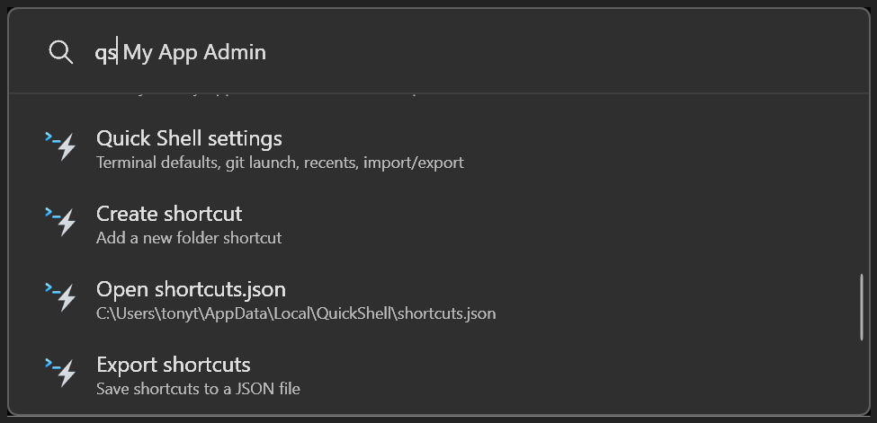

Run ships its own native (WPF) settings window and workspace editor, so both work without Command Palette running:

<table>
<tr>
<td>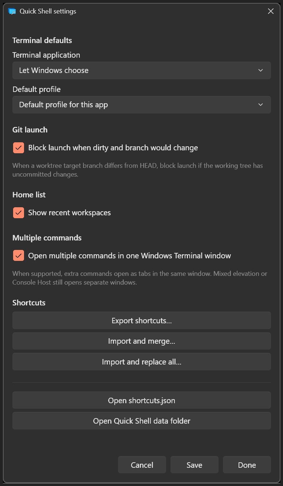</td>
<td>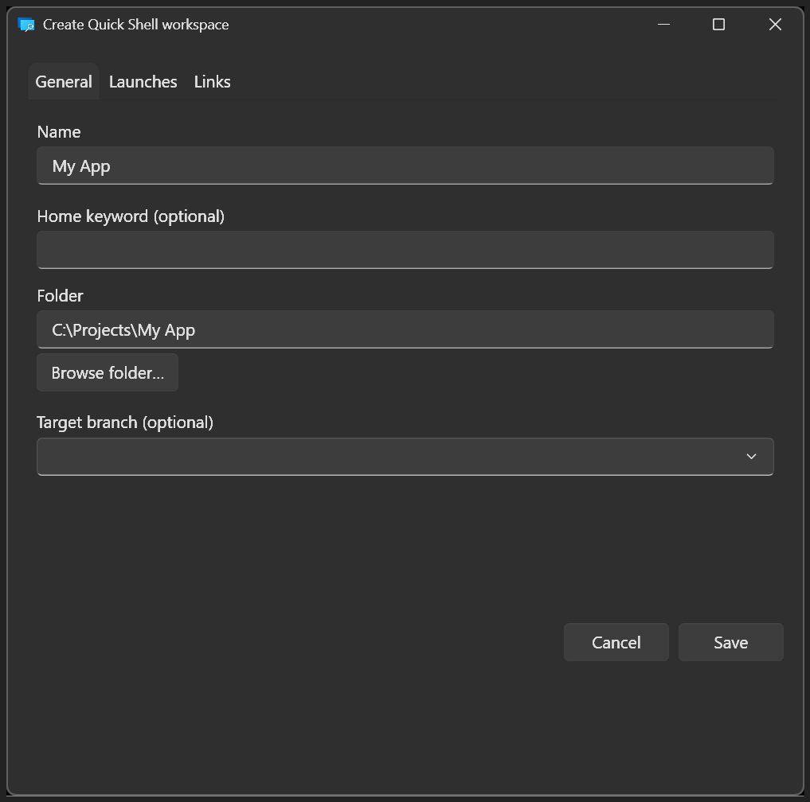</td>
</tr>
<tr>
<td>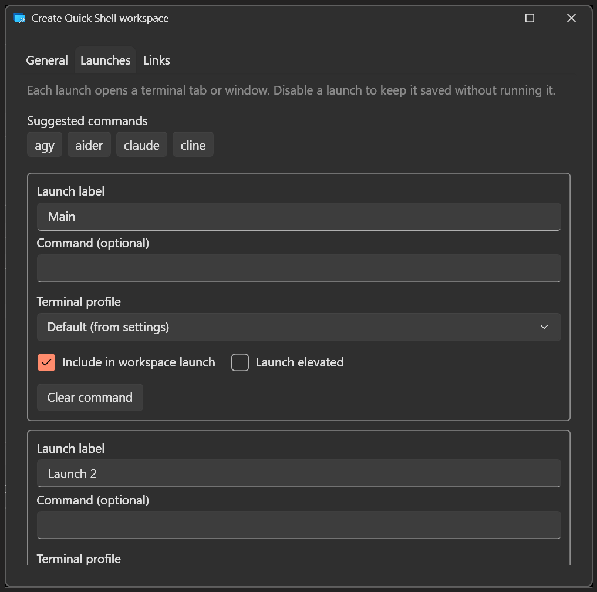</td>
<td>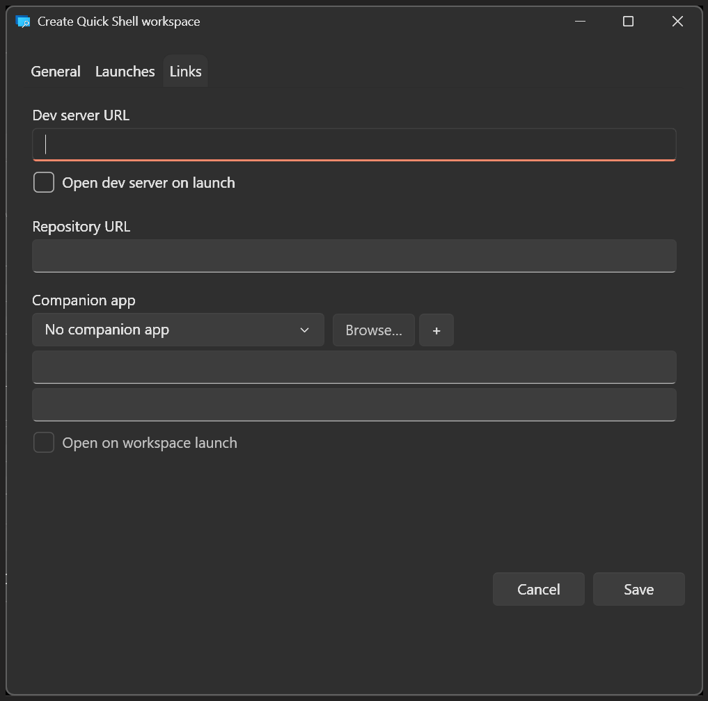</td>
</tr>
</table>

---

## Raycast

A native Raycast for Windows extension covering the same workspace model: **Open Workspace**, **Create Workspace**, **Edit Workspace**, **Discover Git Repos**, and **Manage Workspaces**. Search `qs`, `quickshell`, or a workspace's home keyword from Raycast's root search.

**Install:**
- WinGet: `winget install tonythethompson.QuickShellforRaycast`
- Or download `QuickShellforRaycast-Setup-*-x64.exe` (installer) or `QuickShell.Raycast.zip` (Raycast → Developer → Import Extension) from [GitHub Releases](https://github.com/tonythethompson/QuickShell/releases)

Requires [Raycast for Windows](https://www.raycast.com/). Raycast reads/writes the same `shortcuts.json` as Command Palette and Run, so workspaces stay in sync across all three. See [QuickShell.Raycast/README.md](QuickShell.Raycast/README.md) for commands, preferences, and deeplinks.

<table>
<tr>
<td>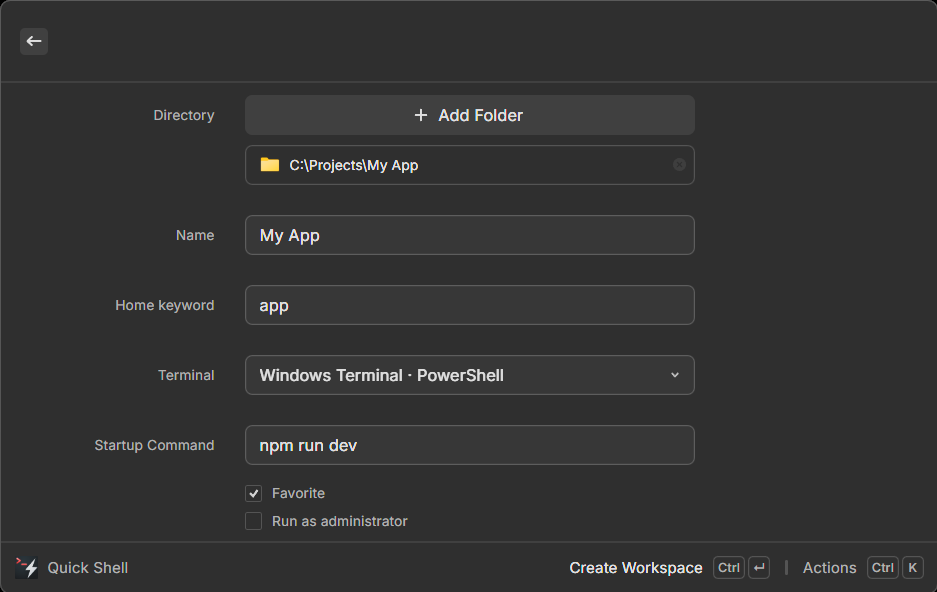</td>
<td>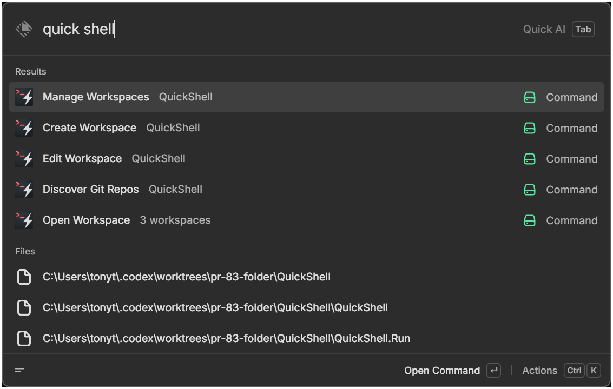</td>
</tr>
</table>

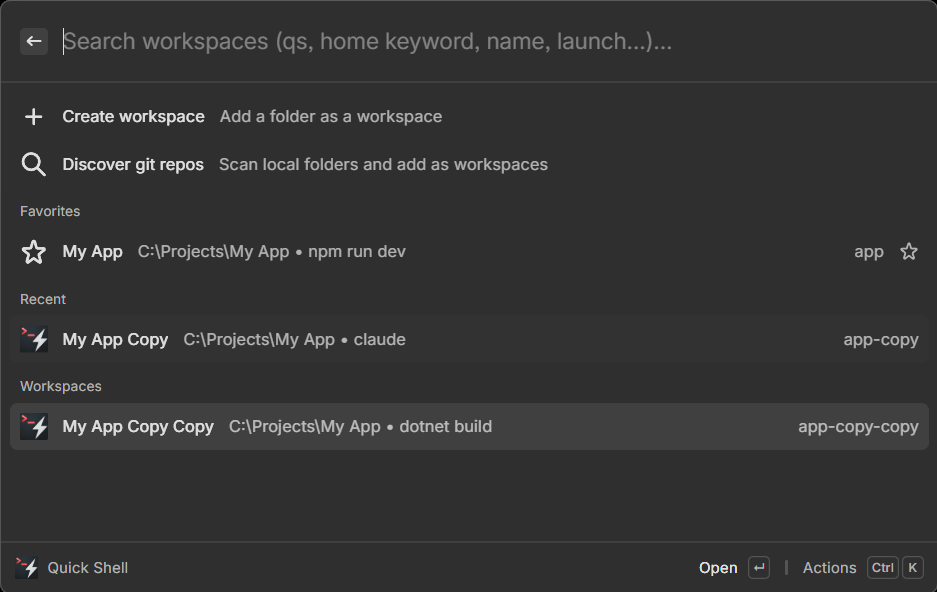

---

## Troubleshooting

**Extension missing after install**  
Run **Reload Command Palette Extension** in Command Palette. Restart PowerToys if needed.

**PowerToys Run (`qs`) not showing**  
Restart PowerToys after install. WinGet and GitHub EXE installs bundle the plugin automatically; Store users need the Run ZIP from Releases (see [PowerToys Run](#powertoys-run)).

**Shortcuts disappeared after an update**  
Check `%LOCALAPPDATA%\QuickShell\shortcuts.json.bak` for a backup. Older installs may also have left a copy at `%LOCALAPPDATA%\TerminalShortcutsCmdPal\shortcuts.json`.

**Duplicate or broken Quick Shell in Windows Settings**  
You may have an old installer alongside a newer one, or both Store and WinGet installed. In **Settings → Apps**, uninstall extra **Quick Shell** entries and keep a single install.

---

## Building from source

For contributors and local MSIX installs (recommended for development):

**Prerequisites:** Windows 11, .NET 10 SDK, Visual Studio 2022 (Windows workload), PowerToys with Command Palette enabled.

```powershell
# All surfaces (CmdPal MSIX + Run plugin + Raycast)
.\scripts\ddeploy.ps1
# same as:
.\scripts\deploy-all.ps1

# CmdPal only: stop CmdPal, build/install signed MSIX, start CmdPal
.\scripts\deploy.ps1

# Same, with local PowerToys CmdPal SDK (sibling PowerToys checkout)
.\scripts\run-cmdpal-dev.ps1 -UseLocalSdk

# Skip UAC entirely (trusts cert in CurrentUser\TrustedPeople)
.\scripts\deploy.ps1 -SkipElevation
.\scripts\ddeploy.ps1 -SkipElevation
```

After the first successful install, `deploy.ps1` stays in your current terminal. It only elevates when the dev certificate is not trusted yet. Approve UAC once if prompted; later runs skip elevation automatically.

**Required after every CmdPal deploy:** run **Reload Command Palette Extension** in Command Palette, then search **Quick Shell**.

**Dev deploy from workspaces:** install launcher shortcuts into your shared shortcuts file, then reload the extension:

```powershell
.\scripts\install-dev-deploy-shortcuts.ps1
```

This adds `ddeploy`, `dcmd`, `drun`, and `dray` workspaces that run the scripts above from PowerShell.

**WinGet EXE vs dev MSIX:** `winget install tonythethompson.QuickShellforCmdPal` installs an unpackaged EXE with COM registration. The dev loop installs a signed MSIX (`tonythethompson.536944BA0D095`). Both target Command Palette but use different registration paths. For local development, uninstall the WinGet CmdPal-only package before using `deploy.ps1`, or CmdPal may load the wrong build. `deploy.ps1` warns when it detects `%LOCALAPPDATA%\Programs\QuickShell\QuickShell.exe`.

---

## License

Apache 2.0. See [LICENSE](LICENSE).

## Website

[quickshell.trackdub.com](https://quickshell.trackdub.com/): install steps, getting started, support, and privacy policy.

**Microsoft Store:** [Quick Shell for CmdPal](https://apps.microsoft.com/detail/9PC8S6LNRT3R) (Store ID: `9PC8S6LNRT3R`)

## Feedback

[Open an issue](https://github.com/tonythethompson/QuickShell/issues) on GitHub for bugs, ideas, or questions. Email: [tonythethompson@hotmail.com](mailto:tonythethompson@hotmail.com).
